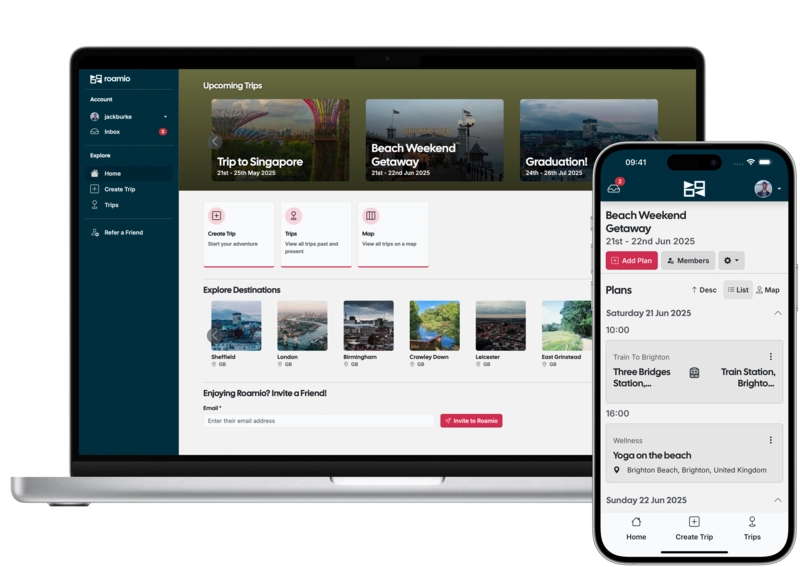

# 2024-25 Genesys COM4525 Team 02

<table align="center"><tr><td align="center" width="9999">

</td></tr></table>

## Introduction

Roamio is a collaborative app to organise trip tickets, bookings, and activities. It is implemented using Ruby on Rails

Key Features include:

- 💎 Built with Ruby on Rails
- 🔑 Authentication with Devise
- 🔒 Authorisation with CanCanCan
- 🎨 Front-end with Bootstrap
- ✅ Fully tested with RSpec and Capybara
- 📦 Database with PostgreSQL

## Installation
- Download [PostgreSQL 14](https://www.postgresql.org), [Ruby 3.3.4](https://www.ruby-lang.org/en/), [Bundler 2.5.17](https://bundler.io), and [Rails 7.0.8.4](https://rubyonrails.org)
- cd into `project/`
- Run `bin/setup`
- Start the application with `bundle exec rails s`
- In a separate terminal window, run `bin/shakapacker-dev-server` to start Shakapacker which will serve and load client side requests

## Default User Accounts
| Role | Email | Password |
| ---- | ----- | -------- |
| Product Owner | admin@genesys.com | AdminGenesys#1 |
 | Reporter | reporter@genesys.com | ReporterGenesys#1 |

## Contributing & Code Standards
Details on contributing & code standards can be found in [CONTRIBUTING.md](./CONTRIBUTING.md)
